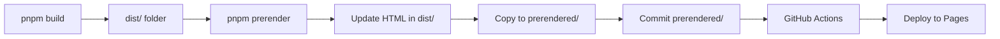

# 🚀 GitHub Pages Deployment Guide

This guide explains how to deploy IT-Tools to GitHub Pages with full SEO optimization.

## 🎯 Recommended Method: Pre-built Deployment

**Why?** Build locally, deploy fast, no timeout issues.

### Quick Start

```bash
# 1. Build locally with interactive menu
pnpm build:github

# 2. Choose prerender option (recommended: 100 pages)
# 3. Wait for build to complete

# 4. Commit prerendered folder
git add prerendered/
git commit -m "chore: build for deployment"
git push

# 5. Deploy via GitHub Actions
# Go to Actions → "Deploy Pre-built Files" → Run workflow
```

⏱️ **Total time**: ~5-7 minutes (3-5 min local build + 1-2 min deploy)

📖 **Full documentation**: [prebuilt-deployment.md](./prebuilt-deployment.md)

---

## 📋 Available Commands

| Command             | Description                               |
| ------------------- | ----------------------------------------- |
| `pnpm build:github` | Interactive local build with prerender    |
| `pnpm build`        | Standard build (no prerender)             |
| `pnpm preview`      | Start preview server                      |
| `pnpm prerender`    | Prerender pages (requires preview server) |

---

## 🎛️ Configuration

### Environment Variables

```bash
export SITEMAP_BASE_URL="https://it-tools.khuong.dev"
export PRERENDER_MAX_PAGES=100      # 0 = all pages, 100 = top 100
export PRERENDER_CONCURRENCY=10     # 5-10 recommended (too high causes timeout)
export PRERENDER_WAIT_TIME=1000     # Wait time per page (ms)
```

**⚠️ Important**: Keep `PRERENDER_CONCURRENCY` between 5-10. Higher values (15-20) will cause timeout errors because the preview server gets overloaded.

### Prerender Options (Interactive Menu)

When you run `pnpm build:github`, choose:

1. **All 377 pages** (~8-10 min) - Best SEO, production releases
2. **Top 100 pages** (~3-5 min) - ⭐ **Recommended** - Good balance
3. **Top 50 pages** (~2-3 min) - Quick updates
4. **Top 25 pages** (~1-2 min) - Fast testing
5. **Skip prerender** (~1 min) - SPA only, no SEO

---

## 🔄 How It Works



**Key points:**

- `dist/` - Build output, **always gitignored**
- `prerendered/` - Copy of dist/, **tracked in git**, used for deployment
- GitHub Actions just uploads files, **no build step** (fast & reliable)

---

## 🆚 Why This Method?

| Aspect                  | Pre-built (This)       | GitHub Actions Build |
| ----------------------- | ---------------------- | -------------------- |
| **Speed**               | ✅ Fast (1-2 min)      | ⚠️ Slow (8-15 min)   |
| **Timeout risk**        | ✅ None                | ❌ High              |
| **Control**             | ✅ Full                | ⚠️ Limited           |
| **Local testing**       | ✅ Yes                 | ❌ No                |
| **GitHub Actions**      | Minimal usage          | Heavy usage          |
| **dist/ in git**        | ✅ Clean               | ❌ Would need force  |
| **prerendered/** in git | ✅ Yes (small updates) | N/A                  |

---

## 🐛 Troubleshooting

### Build fails locally

```bash
# Kill hanging processes
killall node

# Clean and retry
rm -rf dist/ prerendered/
pnpm build:github
```

### prerendered/ folder missing

```bash
# Make sure you ran the build script
pnpm build:github

# Check if it exists
ls -la prerendered/
```

### Deploy fails on GitHub Actions

Check:

- `prerendered/` folder exists and has content
- `prerendered/index.html` exists
- Workflow file: `.github/workflows/deploy-prebuilt.yml`

---

## ✅ After Deployment

Verify your deployment:

1. **Homepage**: <https://it-tools.khuong.dev>
2. **View Source**: Should see full HTML (not empty div)
3. **Sitemap**: <https://it-tools.khuong.dev/sitemap.xml>
4. **Robots.txt**: <https://it-tools.khuong.dev/robots.txt>

---

## � Documentation

- **[prebuilt-deployment.md](./prebuilt-deployment.md)** - Complete guide
- **[prerendered/README.md](../prerendered/README.md)** - About prerendered folder

---

## 💡 Tips

✅ **DO:**

- Build locally before deploying
- Use 50-100 pages for good balance
- Test with `pnpm preview` before committing
- Keep `dist/` gitignored

❌ **DON'T:**

- Commit `dist/` folder
- Build on slow internet connection
- Skip testing locally

---

## 🚀 Quick Deployment Checklist

- [ ] Run `pnpm build:github`
- [ ] Choose prerender option (recommend: 2)
- [ ] Wait for build to complete
- [ ] Check `prerendered/` folder has files
- [ ] `git add prerendered/`
- [ ] `git commit -m "chore: build for deployment"`
- [ ] `git push`
- [ ] Run "Deploy Pre-built Files" workflow
- [ ] Verify deployment works
